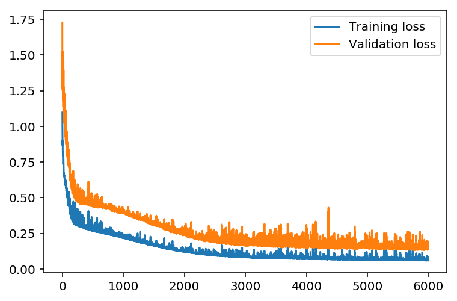
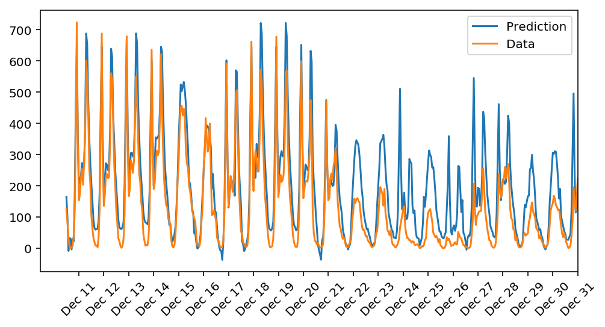

# Predicting-Bike-Sharing-Patterns
The first Udacity Project from the Deep Learning Nanodegree. Using only Numpy to implement forward and back propagation to predict Bike-Sharing Patterns.

### Problem Description:
Bike sharing systems are new generation of traditional bike rentals where whole process from membership, rental and return back has become automatic. Through these systems, user is able to easily rent a bike from a particular position and return back at another position. Currently, there are about over 500 bike-sharing programs around the world which is composed of over 500 thousands bicycles. 
Today, there exists great interest in these systems due to their important role in traffic, environmental and health issues.

### Model Arictecture :

### Training 

### Predictions after training :

### Dataset :
  -  [UCI Machine Learning Database ](https://archive.ics.uci.edu/ml/datasets/Bike+Sharing+Dataset).